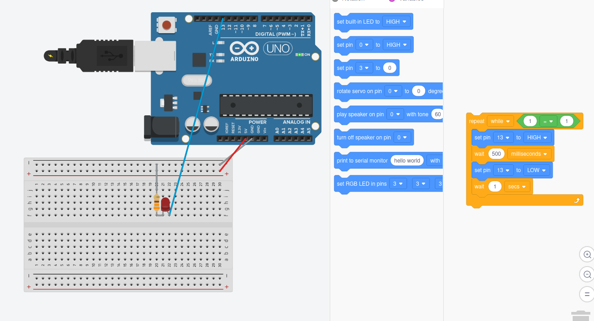
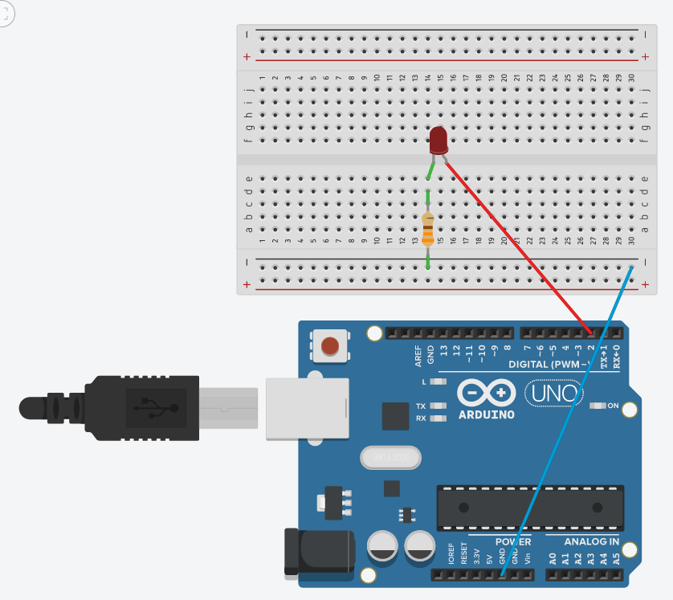
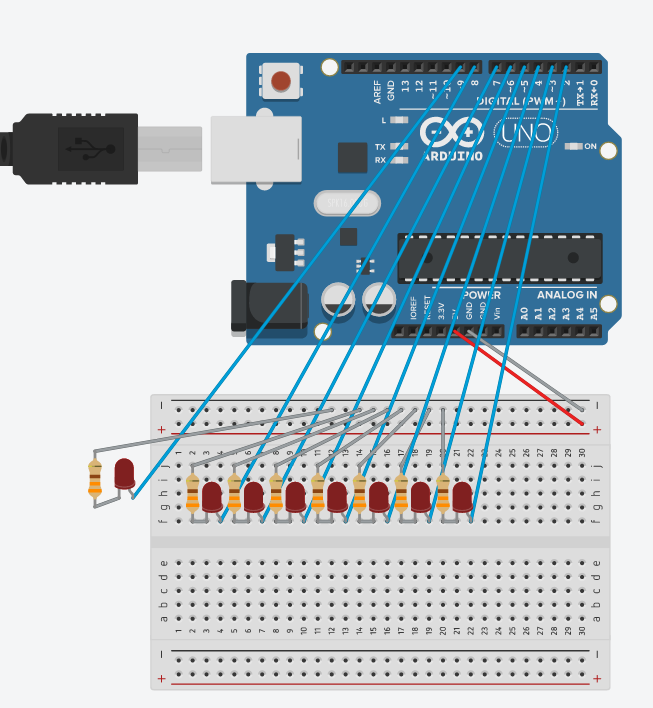

# Chapter 1 - Getting Started

Here are the questions and the circuit's board screenshots of my works in this chapter

1. Change the amount of time the LED is off to 1 second. (Leaving the amount of time the LED is on at 1⁄2 second.)

    

2. Change the pin to which the LED is connected from pin 13 to pin 2. (Note that both the circuit AND the program must be changed.)

    

3. Hook up 8 LEDs to pins 2 through 9 (with resistors, of course.) Modify the code to turn on each one in order and then extinguish them in order. HINT: hook them up one additional LED at a time and make sure the new one works before you add the next one.

    

4. CHALLENGE: Now that you have 8 LEDs working, make them turn on and off in a pattern different from the one in exercise 3.

    
