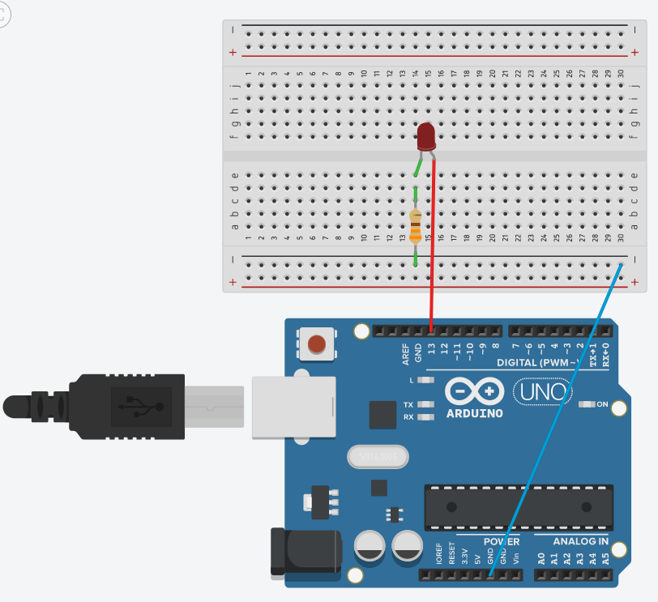
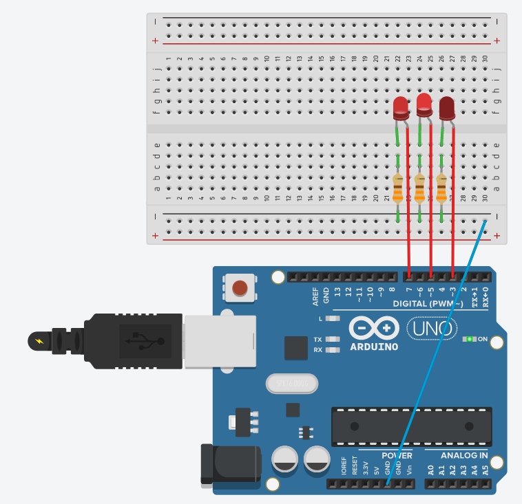

# Chapter 2 - Making Light Patterns

Here are the questions and the circuit's board screenshots of my works in this chapter

1. Modify the blink_for program in Section 2.7 to light the LED up 10 times
in a row instead of 4.

    

2. Make a program (sketch) that lights up a single LED five times in a row
for one second on and off, and then five times in a row for 1⁄2 of a second
on and off.

    

3. Make a program using arrays that lights up the LEDs from top to bottom
and then goes backwards so only one LED is on at any time. (This is often
called a “Cylon” 5 or a “Larson” 6 light.)

    

4. Make a program that lights up the LEDs in any pattern that you like.

    
