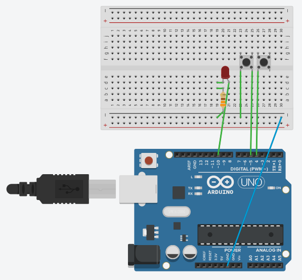
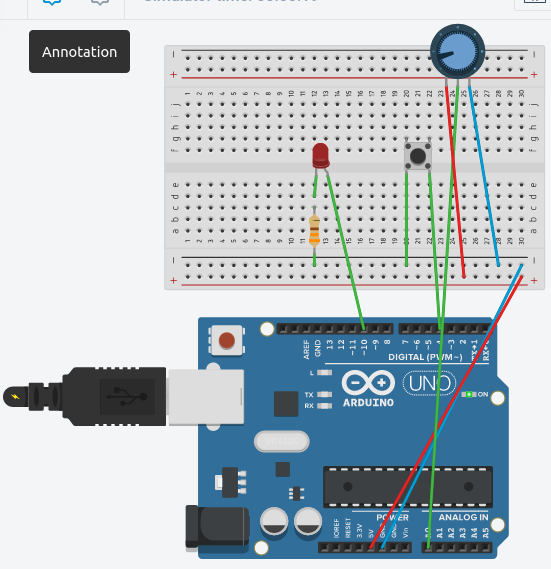
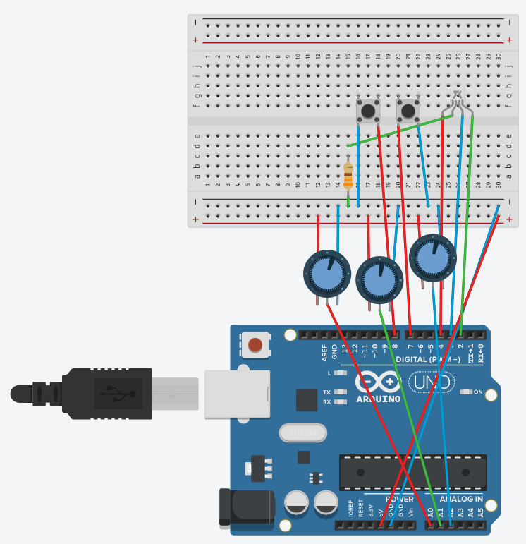

# Chapter 3 - Input

Here is the question and circuit's board screenshot of my works

1. Make the two push buttons a “gas” and “brake” button. The “gas” button
should speed up the blinking rate of the LED, and the “brake” button
should slow it down.

    

2. Change the speed at which the LED blinks based off of the value of the pot ONLY when the first button is pressed. (In other words, you can adjust
the potentiometer, but it has no effect until you press the “ON” button)

    

3. CHALLENGE: Use the two buttons to store a “from” and a “to” color.
When neither button is pressed, the RGB LED should fade smoothly from
one color to the other and back.

    

4. CHALLENGE: Can you find out how long it is between the last statement
in the loop() function and the first one?

    **NO Circuit needed because just question only**