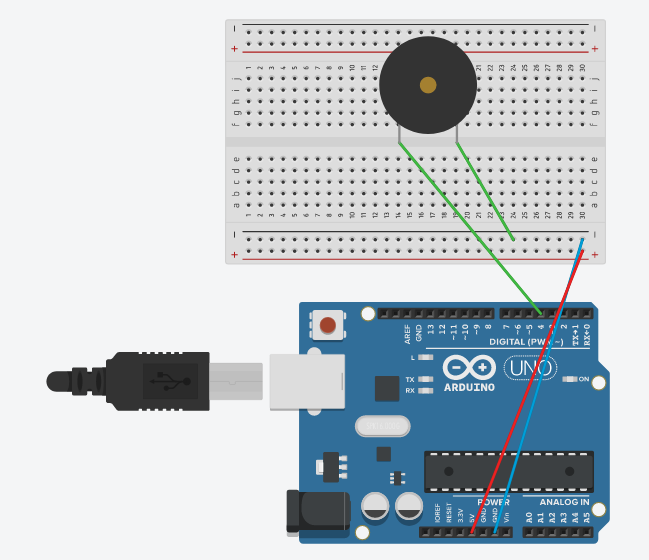
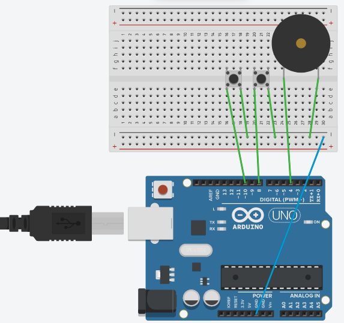

# Chapter 4 - Sound

Here are the questions and the circuit's board screenshots of my works in this chapter

1. Make a sketch that plays the first line of “Happy Birthday” [C4 (1 beat), C4 (1 beat), D4 (2 beats), C4 (2 beats), F4 (2 beats), E4 (4 beats)]

    

2. Add 2 buttons to the circuit. For a reminder of how to hookup and program buttons, see section 3.1. When you press each button have it play a different tune.

    

3. Change ourTone() to not use the tone() and noTone() functions. (HINT: use the technique shown in section 4.2.)

    
