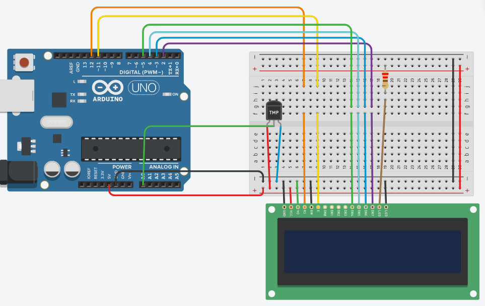

# Chapter 5 - Making a digital thermometer

Here are the questions and the circuit's board screenshots of my works in this chapter

1. Change the program so it displays the voltage returned from the sensor as well as the temperature in Celsius and Fahrenheit.

    

2. Change the program so it displays the temperature in Fahrenheit as well as the maximum and minimum temperatures it has seen.

    

3. CHALLENGE: Modify the program in exercise 2 to also show how long ago (in seconds) the minimum and maximum temperature were seen.

    
