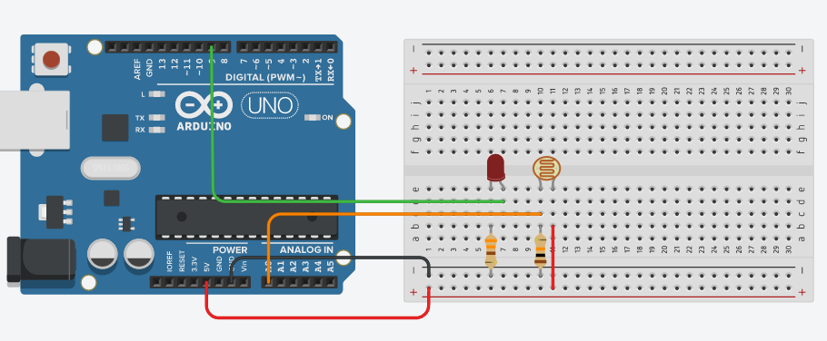
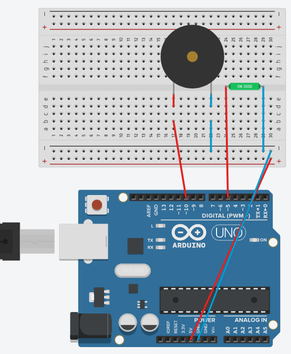
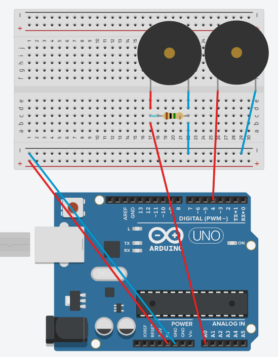

# Chapter 7 - Sensors Galore

Here are the questions and the circuit's board screenshots of my works in this chapter

1. Hook up a photo cell and an LED. Have the LED shine brighter (using PWM) when there is more light and dimmer when there is less light.

    

2. Hook up a Tilt Sensor and the speaker. Have activating of the tilt sensor make an alarm go off.

    

3. Use the reed switch and the magnet to make a sound when the magnet is close.

    **There is no reed switch, so cand be simulated in Tinkercad, but there is still the code.**

4. Hook up the piezo element and use it to play a tune after someone knocks.

    

a. Use the reed switch and the magnet to make a sound when the magnet is close.

    
